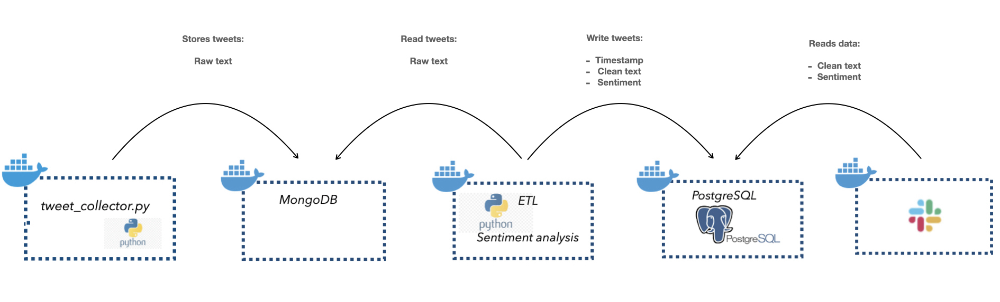
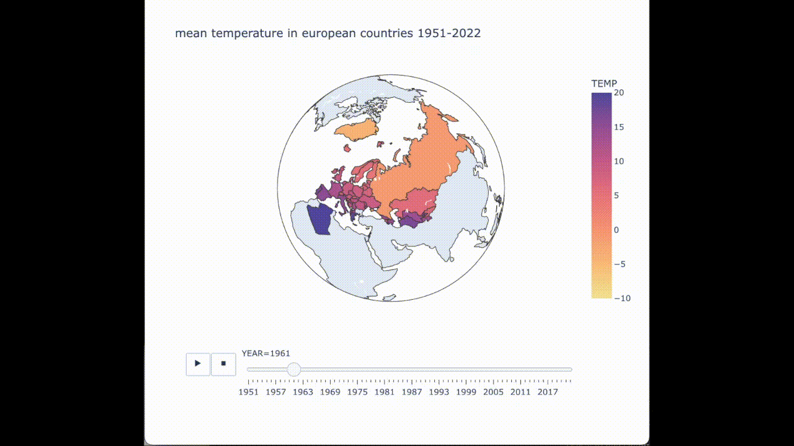
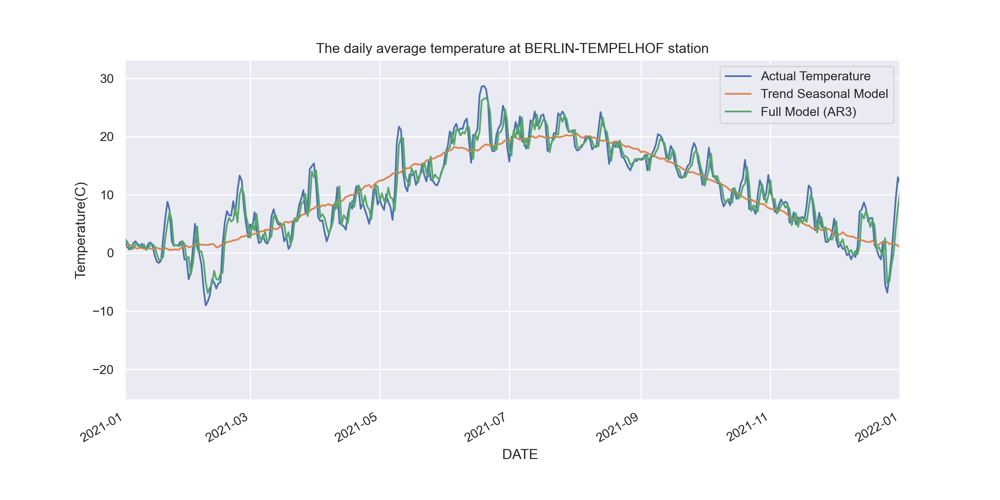
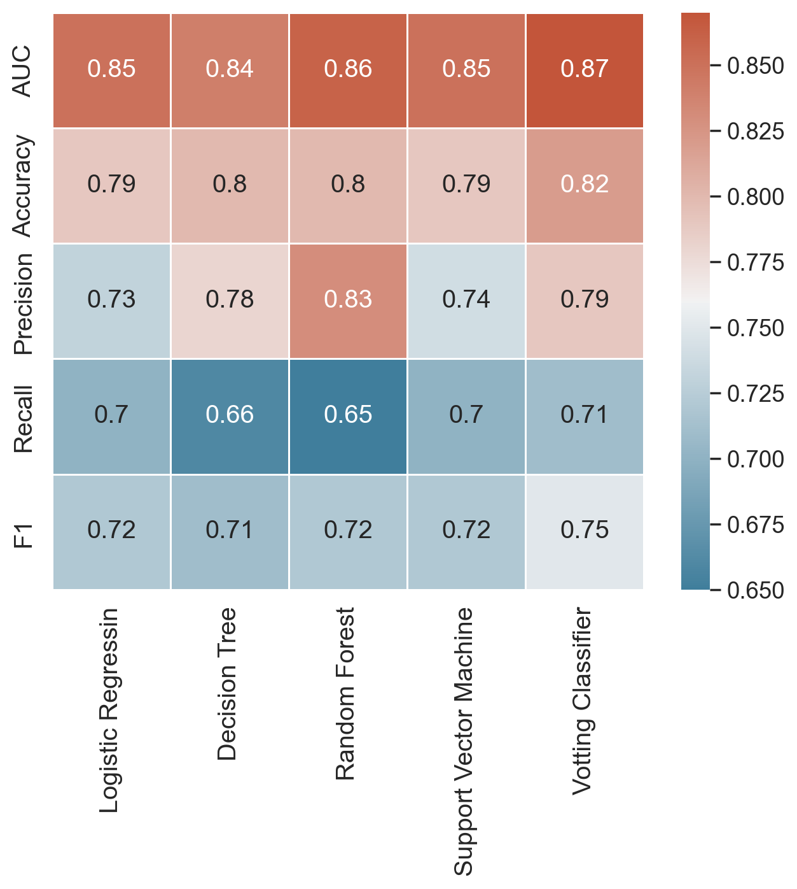
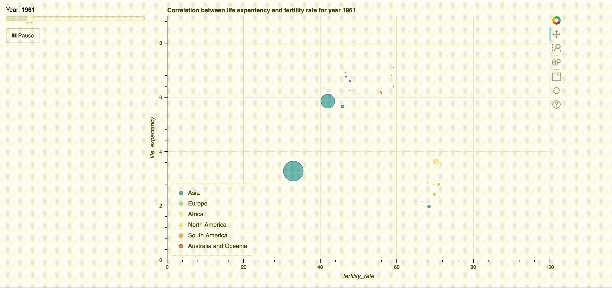
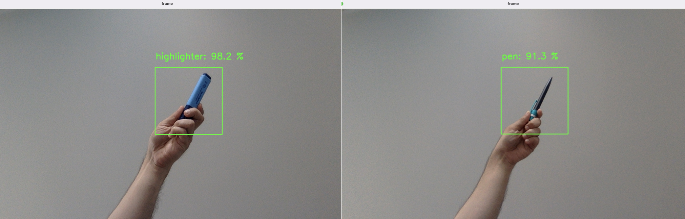

**Welcome!** This page gives an overview of my **most recent and relevant Data Science projects**.

# [Project 1: Image Caption Generator App](https://github.com/miladbehrooz/Image_Caption_Generator) 
----
A **Deep learning-based** **web application** for captioning images developed using **CNN-LSTM encoder-decoder model**.

In this project, the image caption generator using **CNN-LSTM encoder-decoder model** was implemented. The image features were extracted from the **CNN model** and then fed into the **LSTM model** responsible for generating the image captions. **Project workflow** consists of the following steps:

- Created features for each image using **VGG16** pre-trained CNN.
- Prepared text data which involves **text cleaning** and **text tokenization**.
- Transformed image features and text data into input-output data pairs for training the CNN-LSTM model.
- Built, trained, and evaluated an **encoder-decoder neural network**.
- Built an image caption generator **web application** with **Streamlit** based on the CNN-LSTM model.

# [Project 2: Movie Recommender App](https://github.com/miladbehrooz/Movie_Recommender)
A movie **recommender web application** that uses **unsupervised learning methods** to suggest movies based on user input.

- Used a small dataset of [MovieLens](https://grouplens.org/datasets/movielens/) (100,000 ratings applied to 9,000 movies by 600 users) and the **web-scraped movie posters** from [OMDb API](http://www.omdbapi.com/)
- Implemented the following **recommender methods**:
  - Simple Recommender (recommend the most popular movies)
  - **Non-Negative Matrix Factorization (NMF)**
  - **Collaborative Filtering**
- Built a movie **recommender app** with **Flask** - user can select favorites movies. When user rate selected movies, 5 movies based on the NMF algorithm  are recommended 

# [Project 3: A Dockerized Data Pipeline for Sentiment Analysis on tweets](https://github.com/miladbehrooz/Dockerized_Data_Pipeline)
A **data pipeline** with **Docker** to perform **Sentiment Analysis** on tweets and post it on a slack channel via a bot

There are 5 steps in the **data pipeline**:
- Extract tweets with [Tweepy API](https://docs.tweepy.org/en/stable/index.html) 
- Loaded the tweets in a **MongoDB**
- Extracted the tweets from **MongoDB**, performed **sentiment analysis** on the tweets, and loaded the transformed data in a **PostgresDB** **(ETL job)**
- Loaded the tweets and corresponding sentiment assessment in a **PostgresDB**
- Extracted the data from the **PostgresDB** and posted it in a slack channel with a **Slack bot**

# [Project 4: Supermarket Simulation](https://github.com/miladbehrooz/Supermarket_Simulation)
Simulation of the customer behavior in a supermarket with **Markov Chain Modeling** and focusing on **OOP**

The project consists of three parts:
- Performed **Exploratory Data Analysis**
- Calculated the **Transition Probabilities** using **data of customer movement** in a supermarket ('timestamp', 'customer_no', 'location')
- Implemented a **Markov Chain-based simulator** using **OOP** (for one or multiple customers)

# [Prpject 5: Timeseries Analysis Temperature](https://github.com/miladbehrooz/Timeseries_Analysis_Temperature)
Performing step-by-step **time series analysis** of temperature data using the **Trend Seasonal model**, **AR model**, and **ARIMA model**.

- Prepared a **temperature forecast** using temperature data from [the website of the European Climate Assessment & Dataset project](https://www.ecad.eu/)
- Performed **data cleaning** and did a step-by-step **time series analysis** of the data, starting a **base model** to mimic **trend and seasonality**
- Built and evaluated  **AR and ARIMA models**.

Figure : Prediction of temperature for Berlin-Tempelhof station via differnet models for 2021

# [Project 6: Prediction of survival using classification models and deploying the best model as a REST API](https://github.com/miladbehrooz/Classification_Titanic_Data)

- Used Titanic dataset from **Kaggle** to build and compare a **variety of machine learning classifiers** with the **sckit-learn** (logistic regression, decision trees, support vector machine, random forest, voting classifier), in order to predict survival of passengers on the Titanic
- Comprised **all phases of machine learning workflow** (e.g., train-test-splitting the data, data exploration, feature engineering (incl. pipelines), optimization of hyperparameters, evaluation via cross-validation)
- Deployed the best classifier (voting classifier) as a **REST API** using **FastAPI**
 

  
 Figure : Main perfromance metrics for implemented machine learning classifiers
 

# [Project 7: Interactive visualization of the Fertility Rate vs Life Expectancy over time based on Gapminder dataset](https://github.com/miladbehrooz/Gapminder_Data_Analysis)

- Collected data from [Gapminder](https://www.gapminder.org/data/) project
- Used **Pandas** and **Seaborn** to **wrangle**, explore, and **analyze data**
- Generated Gif of Fertility Rate vs Life Expectancy over time using **Seaborn** and **ImageIO**
- Created **Interactive Data Visualization** using **Bokeh**

# [Project 8: Metabase Dashboard based on a PostgreSQL database using AWS (RDS/EC2)](https://github.com/miladbehrooz/PSQL_Dashboard_AWS)
In this project, I have been working with **Northwind Database**, a sample database shipped along with Microsoft Access (data is about 'Northwind Traders', a fictional company and regarding sales transactions)

The project consists of three parts:

- Answered **business questions** on the data using **PostgreSQL queries**.
- Loaded the data into a **PostgreSQL DB** using **AWS RDS** and installed **Metabase** using **AWS EC2**.
- Built an **interactive dashboard** on a **cloud server** using **Metabase**.

# [Project 9: Classification of different objects utilizing convolutional neural networks (CNNs)](https://github.com/miladbehrooz/CNN_Object_Classifier)
Apply **CNN** to **classify** four different objects; **CNN** from scratch and pertained **MobileNet** CNN optimized with **transfer learning**

- Generated  100 images of 4 different objects (pen, highlighter, tomato, apple) plus 160 images for the 'empty' class utilizing this [python script](https://github.com/bonartm/imageclassifier)
- Built and evaluated a **CNN** from scratch using **TensorFlow** and **Keras** and built and evaluated a CNN based on the **MobileNet** CNN using the **transfer learning** approach
- Developed a script to **real-time predict objects** held into the camera

